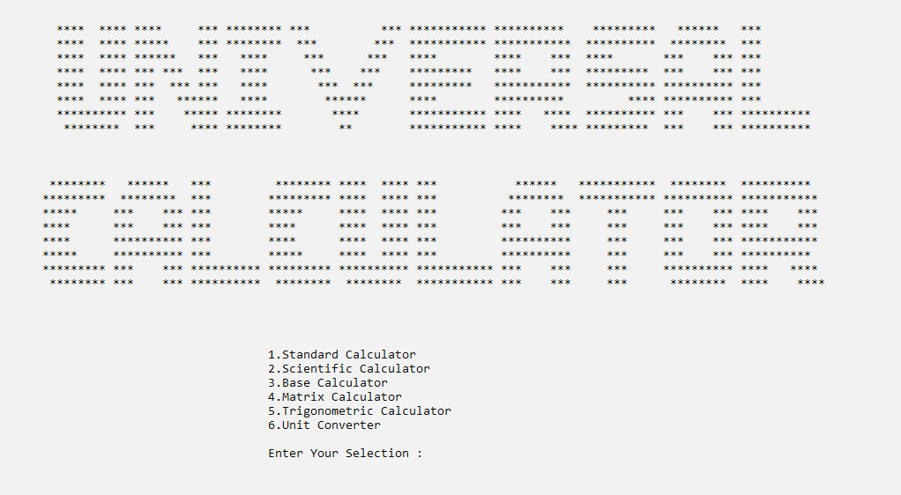

<h1 align="center">Universal Calculator</h1>
<p align="center"><i>Solving mathematical problems.</i></p>
<div align="center">
  <a href="https://github.com/DmetroSK/Universal-Calculator/stargazers"></a>
<a href="https://github.com/DmetroSK/Universal-Calculator/network/members"></a>
<a href="https://github.com/DmetroSK/Universal-Calculator/pulls"></a>
<a href="https://github.com/DmetroSK/Universal-Calculator/issues"></a>
<a href="https://github.com/DmetroSK/Universal-Calculator/graphs/contributors"></a>
<a href="https://github.com/DmetroSK/Universal-Calculator/blob/master/LICENSE"></a>
</div>
<br>


<!-- TABLE OF CONTENTS -->
<details open="open">
  <summary>Table of Contents</summary>
  <ol>
    <li>
      <a href="#about-the-project">About The Project</a>
      <ul>
        <li><a href="#built-with">Built With</a></li>
      </ul>
    </li>
    <li><a href="#getting-started">Getting Started</a>   
    </li>
    <li><a href="#benefits">Benefits</a></li>
    <li><a href="#contributing">Contributing</a></li>
    <li><a href="#release-history">Release History</a></li>
    <li><a href="#license">License</a></li>
    <li><a href="#contact">Contact</a></li>
    <li><a href="#support">Support</a></li>
     </ol>
</details>

<br>

## About The Project 

<br>

A calculator Is a device that performs arithmetic Operations on numbers.
The simplest calculators can do only addition, subtraction, multiplication and division. More sophisticated calculators can handle exponent roots, logarithms, trigonometric functions. Internally some calculators perform these functions by repeated processes of addition.

In addition to the features of an equal calculator our calculator features
matrix calculation, power, base converter and the same calculator. This calculator consists of 4 main parts.

1.	Standard calculator
2.	Scientific calculator
3.	Unit calculator 
4.	Matrix calculation

The components of the above components are as follows

1.	Standard calculator
    *   Addition 
    *   Subtraction
    *  	Multiplication
    *	Division

2.	Scientific calculator
    *	 Square
    *	Power
    *	Factorial
    *	Base converter
3.	Unit calculator 
    *	Distance 
    *	Mass
    *	Area
4.	Matrix calculation
    *	Addition 
    *	Subtraction
    *	Multiplication
    *	Determine
    *	Inverse


<br>



<br>

## Built With

<br>

```sh
C
```

<br>

<!-- GETTING STARTED -->

## Getting Started

<br>

To get a local copy up and running follow program.

  ```sh
   Calculator_Project.exe
   ```

<br>


## Benefits

<br>

1.	This program allocates small size of space in computer hardware
2.	There include new features 
    *	Unit calculator
    *	Matrix calculation  

<br>

<!-- CONTRIBUTING -->

## Contributing

<br>

Contributions are what make the open source community such an amazing place to be learn, inspire, and create. Any contributions you make are **greatly appreciated**.

1. Fork the Project
2. Create your Feature Branch (`git checkout -b feature/AmazingFeature`)
3. Commit your Changes (`git commit -m 'Add some AmazingFeature'`)
4. Push to the Branch (`git push origin feature/AmazingFeature`)
5. Open a Pull Request

<br>


## Release History

<br>

* 0.1.1
    * Release: Beta version.


<br>

<!-- LICENSE -->
## License

<br>

Distributed under the MIT License. See `LICENSE` for more information.

<br>

<!-- CONTACT -->
## Contact

<br>

Email - info@pramuditha-malhara.com

Project Link - [https://github.com/DmetroSK/Calculator](https://github.com/DmetroSK/Universal-Calculator)

<br>

## Support

<br>

Give a ⭐️ if this project helped you!
